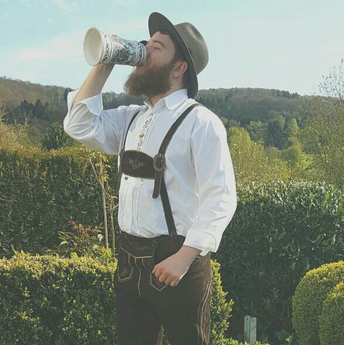
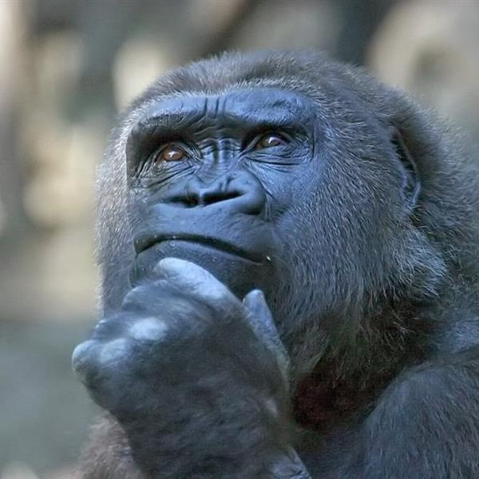
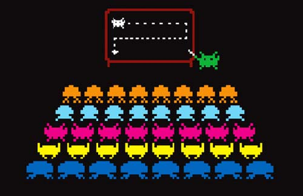
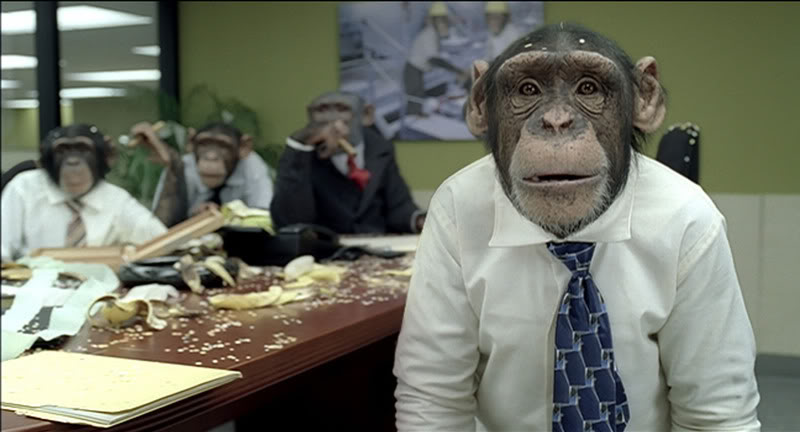
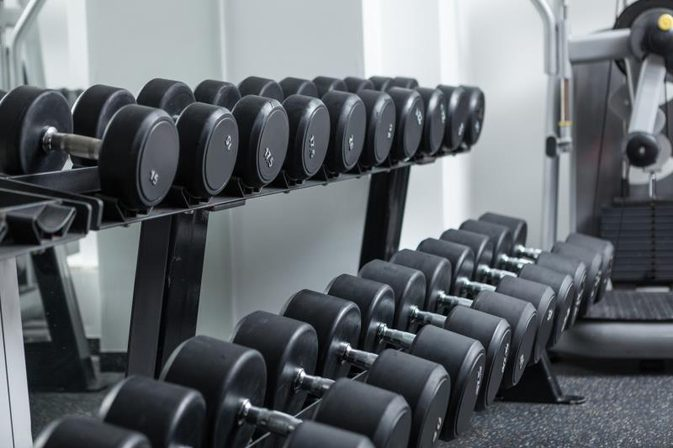

## Deep Learning 101
### Hands on with Python and Keras

---

# About me
* Software Eng. @ trivago doing Deep Learning/Image Recognition
* GitHub Campus Expert

---

## What are we going to build?

A convolutional neural network for classyfing images

---

# Wait, what?

---

---
# Convolutional layer
1. imagine a flashlight that is shining over the top left of the image
2. Let’s say that the light this flashlight shines covers a 5 x 5 area
3. And now, let’s imagine this flashlight sliding across all the areas of the input image. 

---

---
* In CNN terminology, the flaslight is called a ‘filter‘ or ‘kernel’ or ‘feature detector’
* The matrix formed = ‘Convolved Feature’/‘Activation Map’/‘Feature Map‘
* Filters acts as feature detectors from the original input image

---

---

# Plan of attack
---

1. Use pre-trained VGG16 to classify images
2. Build our own neural network
3. Use transfer learning to speedup the training with our custom classes
4. Use our saved weights 

---

# Pre-trained VGG16
---

# Custom CNN
---

# Transfer learning
---

# Use own pre-trained weights
---
# Find me
* Linkedin/Xing: Mikolaj Wawrzyniak
* Twitter: @spejsops
* GitHub: spejss
---

